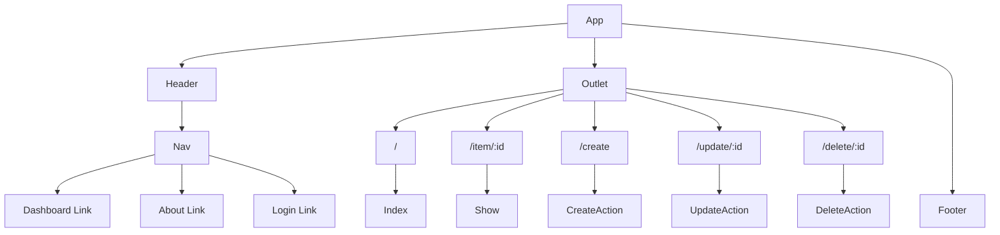

# SupplySmart

- **Description:** 
"SupplySmart" is a dynamic and user-friendly tool for managing an inventory of tools and supplies. With a full CRUD (create, read, update, delete) functionality, the app will allow users to input and store data on each item in the inventory, such as its name, description, quantity, image and location.
Using React's component-based architecture, the app will have a modular design that makes it easy to add new features or modify existing ones. The app will be intuitive and easy to use, with a clear and concise user interface that allows users to quickly and efficiently navigate and manage the inventory.
The app will also have a responsive design, allowing it to work seamlessly on any device, including desktops, laptops, tablets, and smartphones. With this app, users will be able to easily track the availability and location of tools and supplies, making it an essential tool for any workshop, garage, or storage facility.

- **technologies used**:
  * React
  * react-router-dom
  * sass

## Component Architecture

### Frontend Route Table
|    Route    | Element |    Loader   |       Action      |              Description                     |
|-------------|---------|-------------|-------------------|----------------------------------------------|
|      /      |  Index  | indexLoader |                   | Loads up list of items                      |
| /item/:id  |  Show   | eventLoader |                   | Loads up a specific item                    |
|   /create   |  Create |             | eventCreateAction | Handles submission of create form for items |
| /update/:id |  Update |             | eventUpdateAction | Handles submission of update form for items |
| /delete/:id |  Delete |             | eventDeleteAction | Handles submission of delete form for items |

## Mockups

### Desktop Mockup

### Mobile Mockup

  

* [Deployed Website](https://supplysmart-ar.netlify.app/) 

* [Trello Board](https://trello.com/invite/b/bROqOyUz/ATTI1381d204f7d3dbdbeac55c4c344b7d7704D25EDA/inventory-app) 